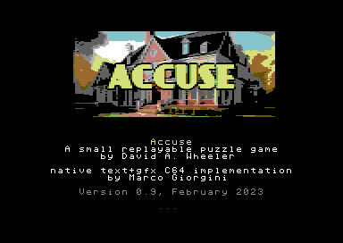

# Accuse-C64
**Accuse** implementation for C64 using my WIP Interactive Fiction Engine **storytllr64**

This replayable IF game is a derivative work (i.e. I "translated" the original Infom7 script into mine, making changes and adding few things) of **David A. Wheeler**'s game with the same name - released a GPL version 2 or later - that you can find here: https://dwheeler.com/accuse/index.html

Once ready, you can find the game page here (it may be an older versione, compared to script/code here): https://marcogiorgini.itch.io/accuse-c64

